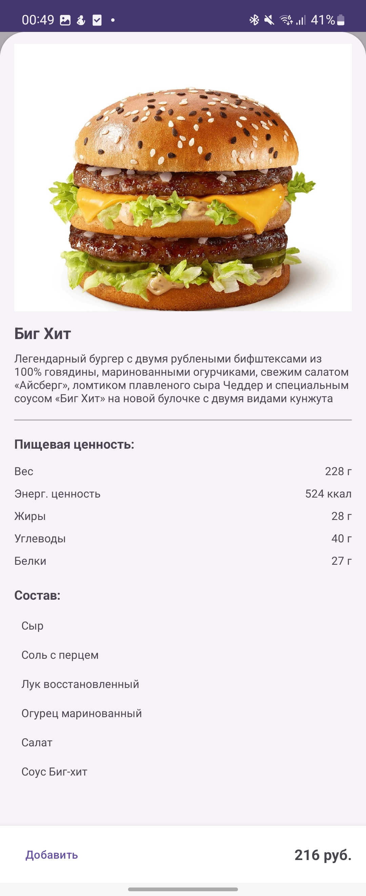

# Menu-app

**Menu-app** — это современное решение для ресторанов, которое превращает процесс заказа в интерактивное и удобное взаимодействие.  
Приложение позволяет организовать виртуальную сессию за столом, где каждый гость выбирает блюда, а их заказы мгновенно отображаются для всех участников.  
Кроме того, **Menu-app** обеспечивает простой и удобный способ справедливого разделения счета между друзьями.

---

## Содержание

* [Цели](#цели)
* [Функциональные требования](#функциональные-требования)
* [Архитектурные решения](#архитектурные-решения)
* [Дизайн решения](#дизайн-решения)
* [Контекстная диаграмма](#контекстная-диаграмма)
* [Технологии и интеграция](#технологии-и-интеграция)
* [Документация API](#документация-api)
* [CI/CD и развертывание](#ci-cd-и-развертывание)
* [Инструкция по запуску](#инструкция-по-запуску)
* [Как выглядит мобильное приложение?](#как-выглядит-мобильное-приложение)
* [Полезные ссылки](#полезные-ссылки)

---

## Цели

Цель проекта **Menu-app** — предоставить ресторанам современный инструмент для интерактивных сессий за столом, позволяющий:

- Клиентам быстро и удобно выбирать блюда через мобильное приложение;
- Автоматически отображать выбранные блюда для всех участников сессии;
- Реализовывать удобное разделение счета между друзьями.

---

## Функциональные требования
- Реализовать распределенное и легко масштабируемое приложение для обеспечения большого кол-ва одновременных сессий.
- Реализовать быструю доставку сообщений до пользователей
- Реализовать механизм, позволяющий пользователю получать информацию, которая была передана в сессии до его присоединения.
- Реализовать динамическую загрузку информации о существующих ресторанах и их меню из базы данных.
- Использовать шифрование конфиденциальных данных для хранения и передачи.
- Реализовать мобильное приложение на Android, с возможностью создавать сессии, присоединятся, отправлять заказы, просматривать информацию о блюдах.
- Реализовать функционал для быстрого разделения счёта между несколькими людьми за одним столом.
- Оптимизировать интерфейс приложения под различные типы мобильных устройств.

---

## Архитектурные решения

Проект реализован на основе упрощённой микросервисной архитектуры с акцентом на низкую связанность компонентов:

- **Микросервисный подход:**  
  Система состоит из двух основных сервисов:
    - **Сервер для WebSocket:** обеспечивает обмен сообщениями в реальном времени между клиентами.
    - **Сервер авторизации и получения списка меню:** реализован на Python с использованием FastAPI.

- **Слабая связанность:**  
  Между сервисом WebSocket и сервером авторизации реализовано минимальное взаимодействие, что позволяет обновлять или масштабировать их независимо.

- **Событийно-ориентированная интеграция:**  
  Для синхронизации двух экземпляров Spring-сервера применяется паттерн event bus на основе Redis Pub/Sub, который эффективно распространяет события между компонентами.  
  Дополнительно, интеграция с внешним брокером сообщений RabbitMQ обеспечивает централизованную и масштабируемую доставку уведомлений пользователям, что значительно повышает отказоустойчивость и гибкость системы при увеличении нагрузки.
---

## Дизайн решения


1. Разработчик делает коммит в git репозиторий. Это запускает CI pipeline, который **собирает сервер (maven)**, **собирает image проекта** и **выкладывает на Docker Hub**.
В проекте мобильного приложения также настроен CI pipeline, который собирает и выпускает неподписанный apk-файл. 
2. В самом приложении находится два сервиса:
  * **RealTime Сообщения** <br>
    * **WebSocket service**. Написан на Java Spring, создает сессии, пересылает сообщения от одних пользователей в сессии другим. Может с легкостью масштабироваться, один инстанс находиться в одном контейнере.
    * **Traefik service**. Балансирует нагрузку между серверами с web-socket.
    * **Redis и RabbitMq**. Брокеры сообщений, могут легко масштабироваться, каждый находиться в отдельном контейнере. (Rabbitmq гарантирует "at-least-once delivery")
  * **Меню service**. Написан с помощью FastAPI, позволяет получать данные о меню ресторана, список всех блюд ресторана. Хранит информацию о пользователе.
3. **Docker Compose**. Позволяет легко осуществлять развертывание приложений на сервер. (В будущем должно будет заменено на k8s, так как k8s предоставляет более гибкие настройки оркестрации/развертывания контейнеров на разных машинах (чего не позволяет делать docker compose)).
4. **S3 Object Storage**. Облачное хранилище для изображений блюд, можно с легкостью масштабировать.

## Контекстная диаграмма


Здесь представлена контекстная диаграмма решения. В ней задействованы три возможные роли: **клиент** (конечный пользователь), **сервер ресторана**, который используется рестораном для проведения сделок и тд, и **внешний сервис оплаты**, позволяющий создать счет:

* **Регистрация/авторизация**. Отвечает за создание учётных записей/проверки доступа и предоставляет нужную информацию о пользователе.
* **Взаимодействие сессии**. Компонент отвечает за создание и взаимодействие пользователей внутри сессии.
* **Разделение счета**. Предназначено для расчёта и формирования итоговых счетов между участниками (функционал не реализован, но должен был).
  Ниже представлена контекстная диаграмма решения. На ней задействованы три основные роли:


При каждом коммите вызывается CI pipeline (файл `workflow/build-cicd.yml`), результат работы:

Image публикуется на Docker Hub:

Результат CI pipeline для мобильного приложения:

## Технологии и интеграция

Проект реализован с использованием следующих технологий:

- **Backend на Java (Spring):**  
  Основной сервер для обработки WebSocket-соединений реализован с помощью Spring.

- **Backend на Python (FastAPI):**  
  Сервис авторизации и получения списка меню разработан на FastAPI.

- **Аутентификация:**  
  Реализована с использованием JWT для обеспечения безопасности.

- **Синхронизация:**  
  Redis pub/sub используется для синхронизации между несколькими инстансами Spring-сервера.

- **Брокер сообщений:**  
  RabbitMQ служит централизованной точкой для доставки сообщений пользователям.

- **PostgreSQL:**  
  Используется для хранения данных приложения.

- **CI/CD:**  
  Автоматизированный процесс сборки и деплоя реализован с помощью GitHub Actions.

- **Контейнеризация:**  
  Проекты упакованы в Docker-контейнеры, а управление мультиконтейнерной конфигурацией осуществляется с помощью Docker Compose.
---

## Документация API

*[Ссылка на документацию API](https://verevka8.github.io/menu_app_general/ApiDocumentation.html)*

---

## CI/CD и развертывание

Проект автоматизирован с помощью GitHub Actions:

- **CI/CD Pipeline:**  
  - Каждый коммит в репозиторий сервера на java запускает workflow, который:
    - Собирает Spring приложение,
    - Собирает его Docker-образ,
    - Производит деплой собранного образа в Docker Hub.
  - Каждый коммит в репозиторий мобильного приложения запускает workflow, который:
    - Тестирует мобильное приложение, 
    - Собирает мобильное приложение,
    - Выпускает apk-файл.
---

## Инструкция по запуску

1. Необходимо запустить файл ```docker-compose.yml``` командой ```docker-compose up -d```, находясь в директории с этим файлом. 
2. Приложение доступно по адресу: ```localhost:80```, dashboard Rabbitmq по адресу: ```localhost:61613```

---

## Как выглядит мобильное приложение?
<div style="display: flex; gap: 4%;">
  <figure style="margin: 10%;">
    
  </figure>
  <figure style="margin: 10%;">
    
  </figure>
  <figure style="margin: 10%;">
    
  </figure>
</div>


1. **Фрагмент меню**. Позволяет пользователю выбирать понравившиеся ему блюда и либо заказать, либо посмотреть доп информацию о них.
2. **Фрагмент дополнительной информации**. Позволяет пользователю посмотреть более детальную информацию о выбранном блюде.
3. **Фрагмент сессии стола**. Отображает все заказы, которые выбрали пользователя, лист заказов прокручивается.
---

## Полезные ссылки

- [Репозиторий сервиса авторизации (FastAPI)](https://github.com/Ratery/rs-cloud-api)
- [Репозиторий WebSocket сервера (Spring)](https://github.com/verevka8/MenuServer)
- [Репозиторий мобильного приложения (Android)](https://github.com/verevka8/MenuApp)

verevka 52 <br>
Ratery